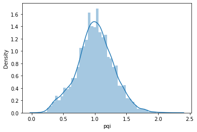
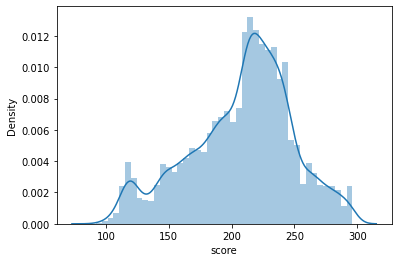
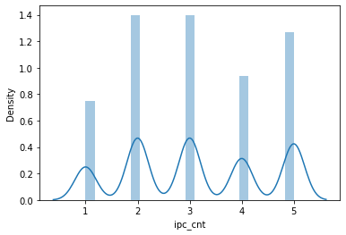
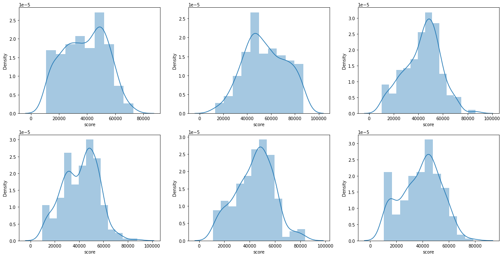
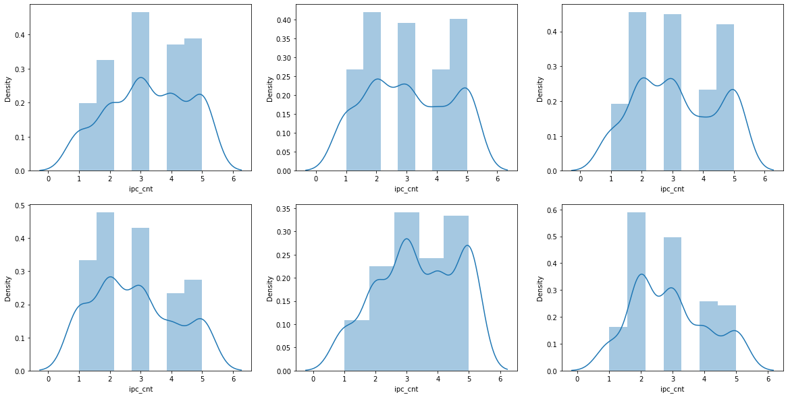
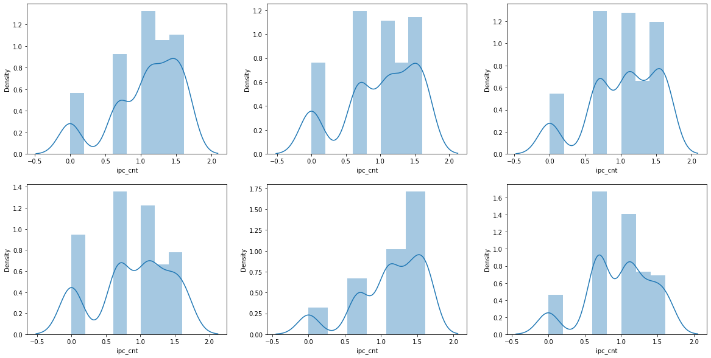

```python
import statsmodels.api as sm
from statsmodels.formula.api import ols
from statsmodels.stats.anova import anova_lm
```

    /usr/local/lib/python3.7/dist-packages/statsmodels/tools/_testing.py:19: FutureWarning: pandas.util.testing is deprecated. Use the functions in the public API at pandas.testing instead.
      import pandas.util.testing as tm
    


```python
import pandas as pd
import warnings
warnings.filterwarnings(action='ignore')
```


```python
data = pd.read_csv('/content/drive/Shareddrives/과학기술일자리진흥원_은채/지식재산연구원 논문/심사의견서_머신러닝_동향분석/Full_data_18_3.csv')
```


```python
data.info()
```

    <class 'pandas.core.frame.DataFrame'>
    RangeIndex: 11448 entries, 0 to 11447
    Data columns (total 32 columns):
     #   Column              Non-Null Count  Dtype  
    ---  ------              --------------  -----  
     0   sumbmityear         11448 non-null  int64  
     1   projectnumber       11448 non-null  int64  
     2   projectnm           11448 non-null  object 
     3   sixtechnologylarge  11439 non-null  object 
     4   사업화유무               11448 non-null  object 
     5   applicationnumber   11448 non-null  int64  
     6   title               11448 non-null  object 
     7   reckonedexpiryterm  11448 non-null  float64
     8   pqi_grade           11448 non-null  object 
     9   pqi                 11448 non-null  float64
     10  grade               11448 non-null  object 
     11  score               11448 non-null  float64
     12  CountryCounts       11448 non-null  int64  
     13  claim_cnt           11448 non-null  float64
     14  예측분류                11448 non-null  object 
     15  기술이전유무              11448 non-null  object 
     16  ipc                 11448 non-null  object 
     17  ipc2                11448 non-null  object 
     18  Log_claim_cnt       11448 non-null  float64
     19  BT(생명공학기술)          11448 non-null  int64  
     20  CT(문화기술)            11448 non-null  int64  
     21  ET(환경기술)            11448 non-null  int64  
     22  IT(정보기술)            11448 non-null  int64  
     23  NT(나노기술)            11448 non-null  int64  
     24  ST(우주항공기술)          11448 non-null  int64  
     25  예측분류_L              11448 non-null  int64  
     26  ipc3                11448 non-null  object 
     27  ipc3_L              11448 non-null  int64  
     28  기술이전사업화유무           11448 non-null  object 
     29  topic               11448 non-null  object 
     30  topic_prob          11448 non-null  float64
     31  ipc_cnt             11448 non-null  int64  
    dtypes: float64(6), int64(13), object(13)
    memory usage: 2.8+ MB
    


```python
moore_lm = ols('pqi ~ C(예측분류_L) + ipc_cnt + topic_prob', data=data).fit()
```


```python
anova_lm(moore_lm, typ=3)
```


<div>
<style scoped>
    .dataframe tbody tr th:only-of-type {
        vertical-align: middle;
    }

    .dataframe tbody tr th {
        vertical-align: top;
    }

    .dataframe thead th {
        text-align: right;
    }
</style>
<table border="1" class="dataframe">
  <thead>
    <tr style="text-align: right;">
      <th></th>
      <th>sum_sq</th>
      <th>df</th>
      <th>F</th>
      <th>PR(&gt;F)</th>
    </tr>
  </thead>
  <tbody>
    <tr>
      <th>Intercept</th>
      <td>592.732359</td>
      <td>1.0</td>
      <td>7107.224183</td>
      <td>0.000000e+00</td>
    </tr>
    <tr>
      <th>C(예측분류_L)</th>
      <td>8.545227</td>
      <td>5.0</td>
      <td>20.492502</td>
      <td>1.982654e-20</td>
    </tr>
    <tr>
      <th>ipc_cnt</th>
      <td>0.720232</td>
      <td>1.0</td>
      <td>8.636021</td>
      <td>3.302388e-03</td>
    </tr>
    <tr>
      <th>topic_prob</th>
      <td>1.169938</td>
      <td>1.0</td>
      <td>14.028274</td>
      <td>1.809662e-04</td>
    </tr>
    <tr>
      <th>Residual</th>
      <td>954.079682</td>
      <td>11440.0</td>
      <td>NaN</td>
      <td>NaN</td>
    </tr>
  </tbody>
</table>
</div>


```python
anova_lm(moore_lm)
```


<div>
<style scoped>
    .dataframe tbody tr th:only-of-type {
        vertical-align: middle;
    }

    .dataframe tbody tr th {
        vertical-align: top;
    }

    .dataframe thead th {
        text-align: right;
    }
</style>
<table border="1" class="dataframe">
  <thead>
    <tr style="text-align: right;">
      <th></th>
      <th>df</th>
      <th>sum_sq</th>
      <th>mean_sq</th>
      <th>F</th>
      <th>PR(&gt;F)</th>
    </tr>
  </thead>
  <tbody>
    <tr>
      <th>C(예측분류_L)</th>
      <td>5.0</td>
      <td>17.458575</td>
      <td>3.491715</td>
      <td>41.867802</td>
      <td>7.147383e-43</td>
    </tr>
    <tr>
      <th>ipc_cnt</th>
      <td>1.0</td>
      <td>0.735533</td>
      <td>0.735533</td>
      <td>8.819490</td>
      <td>2.986486e-03</td>
    </tr>
    <tr>
      <th>topic_prob</th>
      <td>1.0</td>
      <td>1.169938</td>
      <td>1.169938</td>
      <td>14.028274</td>
      <td>1.809662e-04</td>
    </tr>
    <tr>
      <th>Residual</th>
      <td>11440.0</td>
      <td>954.079682</td>
      <td>0.083399</td>
      <td>NaN</td>
      <td>NaN</td>
    </tr>
  </tbody>
</table>
</div>


```python
data.예측분류_L
```


    0        2
    1        3
    2        3
    3        3
    4        0
            ..
    11443    2
    11444    0
    11445    0
    11446    0
    11447    3
    Name: 예측분류_L, Length: 11448, dtype: int64


```python
from statsmodels.multivariate.manova import MANOVA
maov=MANOVA.from_formula('pqi + score + ipc_cnt ~ C(예측분류_L)', data=data)
print(maov.mv_test())
```

                         Multivariate linear model
    ===================================================================
                                                                       
    -------------------------------------------------------------------
           Intercept         Value  Num DF   Den DF    F Value   Pr > F
    -------------------------------------------------------------------
              Wilks' lambda  0.0740 3.0000 11440.0000 47744.2517 0.0000
             Pillai's trace  0.9260 3.0000 11440.0000 47744.2517 0.0000
     Hotelling-Lawley trace 12.5203 3.0000 11440.0000 47744.2517 0.0000
        Roy's greatest root 12.5203 3.0000 11440.0000 47744.2517 0.0000
    -------------------------------------------------------------------
                                                                       
    -------------------------------------------------------------------
             C(예측분류_L)        Value   Num DF   Den DF   F Value  Pr > F
    -------------------------------------------------------------------
                Wilks' lambda 0.8649 15.0000 31581.2039 113.6964 0.0000
               Pillai's trace 0.1379 15.0000 34326.0000 110.2508 0.0000
       Hotelling-Lawley trace 0.1531 15.0000 21603.6549 116.7473 0.0000
          Roy's greatest root 0.1293  5.0000 11442.0000 295.8771 0.0000
    ===================================================================
    
    


```python
maov=MANOVA.from_formula('pqi + score + ipc_cnt ~ 예측분류', data=data)
print(maov.mv_test())
```

                         Multivariate linear model
    ===================================================================
                                                                       
    -------------------------------------------------------------------
           Intercept         Value  Num DF   Den DF    F Value   Pr > F
    -------------------------------------------------------------------
              Wilks' lambda  0.0740 3.0000 11440.0000 47744.2517 0.0000
             Pillai's trace  0.9260 3.0000 11440.0000 47744.2517 0.0000
     Hotelling-Lawley trace 12.5203 3.0000 11440.0000 47744.2517 0.0000
        Roy's greatest root 12.5203 3.0000 11440.0000 47744.2517 0.0000
    -------------------------------------------------------------------
                                                                       
    -------------------------------------------------------------------
                예측분류          Value   Num DF   Den DF   F Value  Pr > F
    -------------------------------------------------------------------
                Wilks' lambda 0.8649 15.0000 31581.2039 113.6964 0.0000
               Pillai's trace 0.1379 15.0000 34326.0000 110.2508 0.0000
       Hotelling-Lawley trace 0.1531 15.0000 21603.6549 116.7473 0.0000
          Roy's greatest root 0.1293  5.0000 11442.0000 295.8771 0.0000
    ===================================================================
    
    


```python
import seaborn as sns
import matplotlib.pyplot as plt

sns.distplot(data['pqi'])
```

    /usr/local/lib/python3.7/dist-packages/seaborn/distributions.py:2557: FutureWarning: `distplot` is a deprecated function and will be removed in a future version. Please adapt your code to use either `displot` (a figure-level function with similar flexibility) or `histplot` (an axes-level function for histograms).
      warnings.warn(msg, FutureWarning)
    


    <matplotlib.axes._subplots.AxesSubplot at 0x7f851a6def50>





```python
sns.distplot(data['score'])
```

    /usr/local/lib/python3.7/dist-packages/seaborn/distributions.py:2557: FutureWarning: `distplot` is a deprecated function and will be removed in a future version. Please adapt your code to use either `displot` (a figure-level function with similar flexibility) or `histplot` (an axes-level function for histograms).
      warnings.warn(msg, FutureWarning)
    


    <matplotlib.axes._subplots.AxesSubplot at 0x7f8524113550>





```python
sns.distplot(data['ipc_cnt'])
```

    /usr/local/lib/python3.7/dist-packages/seaborn/distributions.py:2557: FutureWarning: `distplot` is a deprecated function and will be removed in a future version. Please adapt your code to use either `displot` (a figure-level function with similar flexibility) or `histplot` (an axes-level function for histograms).
      warnings.warn(msg, FutureWarning)
    


    <matplotlib.axes._subplots.AxesSubplot at 0x7f8519e3a410>





```python
maov=MANOVA.from_formula('pqi + score + ipc_cnt ~ 예측분류', data=data)
print(maov.mv_test())
```

                         Multivariate linear model
    ===================================================================
                                                                       
    -------------------------------------------------------------------
           Intercept         Value  Num DF   Den DF    F Value   Pr > F
    -------------------------------------------------------------------
              Wilks' lambda  0.0740 3.0000 11440.0000 47744.2517 0.0000
             Pillai's trace  0.9260 3.0000 11440.0000 47744.2517 0.0000
     Hotelling-Lawley trace 12.5203 3.0000 11440.0000 47744.2517 0.0000
        Roy's greatest root 12.5203 3.0000 11440.0000 47744.2517 0.0000
    -------------------------------------------------------------------
                                                                       
    -------------------------------------------------------------------
                예측분류          Value   Num DF   Den DF   F Value  Pr > F
    -------------------------------------------------------------------
                Wilks' lambda 0.8649 15.0000 31581.2039 113.6964 0.0000
               Pillai's trace 0.1379 15.0000 34326.0000 110.2508 0.0000
       Hotelling-Lawley trace 0.1531 15.0000 21603.6549 116.7473 0.0000
          Roy's greatest root 0.1293  5.0000 11442.0000 295.8771 0.0000
    ===================================================================
    
    

1. 독립성 - random sampling 진행


```python
data[['projectnumber','예측분류']].groupby('예측분류').agg(len)
```


<div>
<style scoped>
    .dataframe tbody tr th:only-of-type {
        vertical-align: middle;
    }

    .dataframe tbody tr th {
        vertical-align: top;
    }

    .dataframe thead th {
        text-align: right;
    }
</style>
<table border="1" class="dataframe">
  <thead>
    <tr style="text-align: right;">
      <th></th>
      <th>projectnumber</th>
    </tr>
    <tr>
      <th>예측분류</th>
      <th></th>
    </tr>
  </thead>
  <tbody>
    <tr>
      <th>BT(생명공학기술)</th>
      <td>3001</td>
    </tr>
    <tr>
      <th>CT(문화기술)</th>
      <td>274</td>
    </tr>
    <tr>
      <th>ET(환경기술)</th>
      <td>3123</td>
    </tr>
    <tr>
      <th>IT(정보기술)</th>
      <td>3377</td>
    </tr>
    <tr>
      <th>NT(나노기술)</th>
      <td>1415</td>
    </tr>
    <tr>
      <th>ST(우주항공기술)</th>
      <td>258</td>
    </tr>
  </tbody>
</table>
</div>


```python
def gpSampling(data, group, group_N, random_num=123) :
        
    import pandas as pd

    df_data_sp = data.sample(frac=1,random_state=random_num,replace = False).groupby(by = group).head(group_N) # group에 따라 일정 개수의 샘플을 복원 추출하여 사용한다.

    return df_data_sp
```


```python
data_sampled = gpSampling(data, '예측분류', 300)
```

2. 정규성 만족


```python
set(data_sampled['예측분류'])
```


    {'BT(생명공학기술)', 'CT(문화기술)', 'ET(환경기술)', 'IT(정보기술)', 'NT(나노기술)', 'ST(우주항공기술)'}


```python
f,axes = plt.subplots(2,3, figsize=(20,10))

sns.distplot(data_sampled['pqi'][data_sampled['예측분류']=='CT(문화기술)'], ax=axes[0,0])
sns.distplot(data_sampled['pqi'][data_sampled['예측분류']=='BT(생명공학기술)'], ax=axes[0,1])
sns.distplot(data_sampled['pqi'][data_sampled['예측분류']=='ET(환경기술)'], ax=axes[0,2])
sns.distplot(data_sampled['pqi'][data_sampled['예측분류']=='IT(정보기술)'], ax=axes[1,0])
sns.distplot(data_sampled['pqi'][data_sampled['예측분류']=='NT(나노기술)'], ax=axes[1,1])
sns.distplot(data_sampled['pqi'][data_sampled['예측분류']=='ST(우주항공기술)'], ax=axes[1,2])
```


    <matplotlib.axes._subplots.AxesSubplot at 0x7f8509174e90>


```python
f,axes = plt.subplots(2,3, figsize=(20,10))

sns.distplot(data_sampled['score'][data_sampled['예측분류']=='CT(문화기술)'], ax=axes[0,0])
sns.distplot(data_sampled['score'][data_sampled['예측분류']=='BT(생명공학기술)'], ax=axes[0,1])
sns.distplot(data_sampled['score'][data_sampled['예측분류']=='ET(환경기술)'], ax=axes[0,2])
sns.distplot(data_sampled['score'][data_sampled['예측분류']=='IT(정보기술)'], ax=axes[1,0])
sns.distplot(data_sampled['score'][data_sampled['예측분류']=='NT(나노기술)'], ax=axes[1,1])
sns.distplot(data_sampled['score'][data_sampled['예측분류']=='ST(우주항공기술)'], ax=axes[1,2])
```


    <matplotlib.axes._subplots.AxesSubplot at 0x7f8508d99a90>


```python
f,axes = plt.subplots(2,3, figsize=(20,10))

sns.distplot(data_sampled['score'][data_sampled['예측분류']=='CT(문화기술)']**2, ax=axes[0,0])
sns.distplot(data_sampled['score'][data_sampled['예측분류']=='BT(생명공학기술)']**2, ax=axes[0,1])
sns.distplot(data_sampled['score'][data_sampled['예측분류']=='ET(환경기술)']**2, ax=axes[0,2])
sns.distplot(data_sampled['score'][data_sampled['예측분류']=='IT(정보기술)']**2, ax=axes[1,0])
sns.distplot(data_sampled['score'][data_sampled['예측분류']=='NT(나노기술)']**2, ax=axes[1,1])
sns.distplot(data_sampled['score'][data_sampled['예측분류']=='ST(우주항공기술)']**2, ax=axes[1,2])
```


    <matplotlib.axes._subplots.AxesSubplot at 0x7f8508ac1450>





```python
f,axes = plt.subplots(2,3, figsize=(20,10))

sns.distplot(data_sampled['ipc_cnt'][data_sampled['예측분류']=='CT(문화기술)'], ax=axes[0,0])
sns.distplot(data_sampled['ipc_cnt'][data_sampled['예측분류']=='BT(생명공학기술)'], ax=axes[0,1])
sns.distplot(data_sampled['ipc_cnt'][data_sampled['예측분류']=='ET(환경기술)'], ax=axes[0,2])
sns.distplot(data_sampled['ipc_cnt'][data_sampled['예측분류']=='IT(정보기술)'], ax=axes[1,0])
sns.distplot(data_sampled['ipc_cnt'][data_sampled['예측분류']=='NT(나노기술)'], ax=axes[1,1])
sns.distplot(data_sampled['ipc_cnt'][data_sampled['예측분류']=='ST(우주항공기술)'], ax=axes[1,2])
```


    <matplotlib.axes._subplots.AxesSubplot at 0x7f850878d050>





```python
import numpy as np

f,axes = plt.subplots(2,3, figsize=(20,10))

sns.distplot(np.log(data_sampled['ipc_cnt'][data_sampled['예측분류']=='CT(문화기술)']), ax=axes[0,0])
sns.distplot(np.log(data_sampled['ipc_cnt'][data_sampled['예측분류']=='BT(생명공학기술)']), ax=axes[0,1])
sns.distplot(np.log(data_sampled['ipc_cnt'][data_sampled['예측분류']=='ET(환경기술)']), ax=axes[0,2])
sns.distplot(np.log(data_sampled['ipc_cnt'][data_sampled['예측분류']=='IT(정보기술)']), ax=axes[1,0])
sns.distplot(np.log(data_sampled['ipc_cnt'][data_sampled['예측분류']=='NT(나노기술)']), ax=axes[1,1])
sns.distplot(np.log(data_sampled['ipc_cnt'][data_sampled['예측분류']=='ST(우주항공기술)']), ax=axes[1,2])
```


    <matplotlib.axes._subplots.AxesSubplot at 0x7f8508500f10>





```python
data_sampled['score_2']=[x**2 for x in data_sampled['score']]
```

3. 등분산성


```python
import scipy
```


```python
scipy.stats.levene(
    data_sampled.score[data_sampled.예측분류 == 'CT(문화기술)'],
    data_sampled.score[data_sampled.예측분류 == 'BT(생명공학기술)'],
    data_sampled.score[data_sampled.예측분류 == 'ET(환경기술)'],
    data_sampled.score[data_sampled.예측분류 == 'IT(정보기술)'],
    data_sampled.score[data_sampled.예측분류 == 'NT(나노기술)'],
    data_sampled.score[data_sampled.예측분류 == 'ST(우주항공기술)'],)
```


    LeveneResult(statistic=1.7932490047476697, pvalue=0.11104264617427342)


```python
scipy.stats.levene(
    data_sampled.pqi[data_sampled.예측분류 == 'CT(문화기술)'],
    data_sampled.pqi[data_sampled.예측분류 == 'BT(생명공학기술)'],
    data_sampled.pqi[data_sampled.예측분류 == 'ET(환경기술)'],
    data_sampled.pqi[data_sampled.예측분류 == 'IT(정보기술)'],
    data_sampled.pqi[data_sampled.예측분류 == 'NT(나노기술)'],
    data_sampled.pqi[data_sampled.예측분류 == 'ST(우주항공기술)'],)
```


    LeveneResult(statistic=0.3786895075055586, pvalue=0.8636019543573566)


```python
scipy.stats.levene(
    data_sampled.ipc_cnt[data_sampled.예측분류 == 'CT(문화기술)'],
    data_sampled.ipc_cnt[data_sampled.예측분류 == 'BT(생명공학기술)'],
    data_sampled.ipc_cnt[data_sampled.예측분류 == 'ET(환경기술)'],
    data_sampled.ipc_cnt[data_sampled.예측분류 == 'IT(정보기술)'],
    data_sampled.ipc_cnt[data_sampled.예측분류 == 'NT(나노기술)'],
    data_sampled.ipc_cnt[data_sampled.예측분류 == 'ST(우주항공기술)'],)
```


    LeveneResult(statistic=2.222153514596622, pvalue=0.049724807710534724)


```python
maov=MANOVA.from_formula('pqi + score + ipc_cnt ~ 예측분류', data=data_sampled)
print(maov.mv_test())
```

                       Multivariate linear model
    ================================================================
                                                                    
    ----------------------------------------------------------------
           Intercept        Value  Num DF   Den DF   F Value  Pr > F
    ----------------------------------------------------------------
              Wilks' lambda 0.0985 3.0000 1724.0000 5261.2082 0.0000
             Pillai's trace 0.9015 3.0000 1724.0000 5261.2082 0.0000
     Hotelling-Lawley trace 9.1552 3.0000 1724.0000 5261.2082 0.0000
        Roy's greatest root 9.1552 3.0000 1724.0000 5261.2082 0.0000
    ----------------------------------------------------------------
                                                                    
    ----------------------------------------------------------------
               예측분류          Value   Num DF   Den DF  F Value Pr > F
    ----------------------------------------------------------------
               Wilks' lambda 0.8381 15.0000 4759.6063 20.9708 0.0000
              Pillai's trace 0.1670 15.0000 5178.0000 20.3509 0.0000
      Hotelling-Lawley trace 0.1872 15.0000 3251.2137 21.5071 0.0000
         Roy's greatest root 0.1492  5.0000 1726.0000 51.5071 0.0000
    ================================================================
    
    


```python
maov=MANOVA.from_formula('pqi + score ~ 예측분류', data=data_sampled)
print(maov.mv_test())
```

                       Multivariate linear model
    ================================================================
                                                                    
    ----------------------------------------------------------------
           Intercept        Value  Num DF   Den DF   F Value  Pr > F
    ----------------------------------------------------------------
              Wilks' lambda 0.2215 2.0000 1725.0000 3031.3782 0.0000
             Pillai's trace 0.7785 2.0000 1725.0000 3031.3782 0.0000
     Hotelling-Lawley trace 3.5146 2.0000 1725.0000 3031.3782 0.0000
        Roy's greatest root 3.5146 2.0000 1725.0000 3031.3782 0.0000
    ----------------------------------------------------------------
                                                                    
    ----------------------------------------------------------------
               예측분류          Value   Num DF   Den DF  F Value Pr > F
    ----------------------------------------------------------------
               Wilks' lambda 0.8502 10.0000 3450.0000 29.1684 0.0000
              Pillai's trace 0.1519 10.0000 3452.0000 28.3645 0.0000
      Hotelling-Lawley trace 0.1739 10.0000 2584.7515 29.9791 0.0000
         Roy's greatest root 0.1589  5.0000 1726.0000 54.8411 0.0000
    ================================================================
    
    


```python

```
